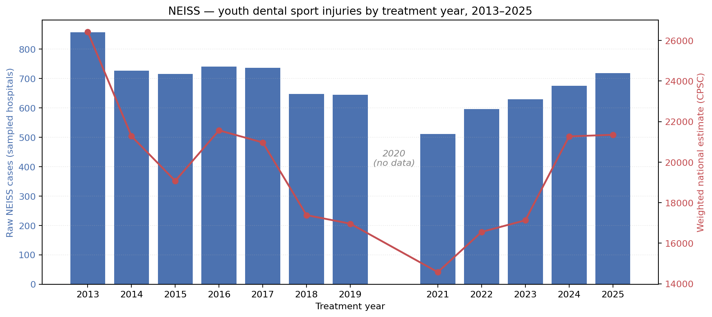
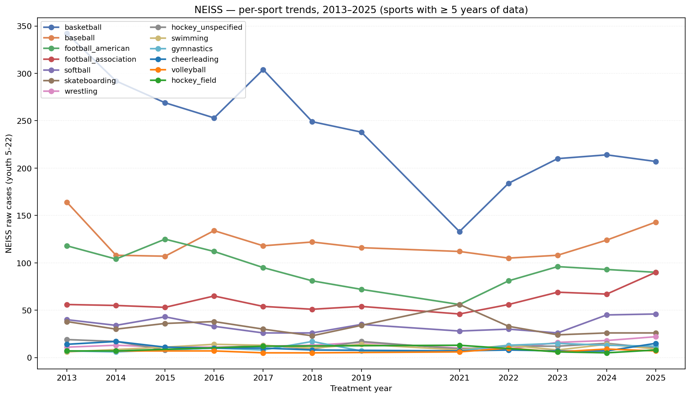
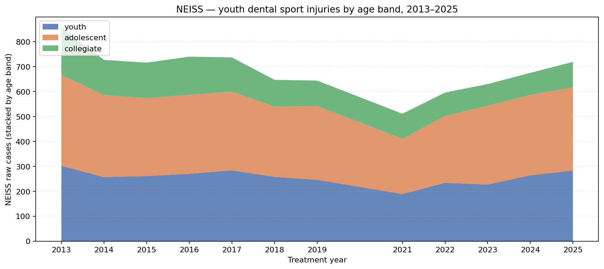

# NEISS year-over-year trends — 2013–2025

_Auto-generated from `data/harmonized/master.csv`. Covers 12 treatment years of NEISS data on youth (ages 5–22) sport-related mouth injuries._

## Overview

This is the first time, to our knowledge, that **12 treatment years** of NEISS dental-sport data has been aggregated into a single comparable table for the youth (5–22) age range. The 2020 gap reflects the COVID-19 youth-sports shutdown — the CPSC query returned zero matching cases for that year.

## Overall trend

| year | raw NEISS cases | weighted national estimate |
|---:|---:|---:|
| 2013 | 857 | 26,424 |
| 2014 | 727 | 21,276 |
| 2015 | 716 | 19,073 |
| 2016 | 740 | 21,565 |
| 2017 | 737 | 20,967 |
| 2018 | 647 | 17,383 |
| 2019 | 644 | 16,962 |
| 2021 | 511 | 14,572 |
| 2022 | 596 | 16,555 |
| 2023 | 630 | 17,128 |
| 2024 | 675 | 21,267 |
| 2025 | 719 | 21,347 |
| **Total** | **8,199** | **234,519** |

## Per-sport trends (sports with ≥ 5 years of data)

| year | basketball | baseball | football_american | football_association | softball | skateboarding | wrestling | gymnastics | hockey_unspecified | swimming | cheerleading | hockey_field | volleyball |
|---:|---:|---:|---:|---:|---:|---:|---:|---:|---:|---:|---:|---:|---:|
| 2013 | 342 | 164 | 118 | 56 | 40 | 38 | 11 | 7 | 19 | 6 | 14 | 7 | - |
| 2014 | 292 | 108 | 104 | 55 | 34 | 30 | 13 | 6 | 17 | - | 17 | 7 | 7 |
| 2015 | 269 | 107 | 125 | 53 | 43 | 36 | 11 | - | 8 | 11 | 11 | - | - |
| 2016 | 253 | 134 | 112 | 65 | 33 | 38 | 11 | 10 | 10 | 14 | 10 | - | 7 |
| 2017 | 304 | 118 | 95 | 54 | 26 | 30 | 12 | 8 | 13 | 13 | 10 | 12 | 5 |
| 2018 | 249 | 122 | 81 | 51 | 26 | 23 | 13 | 17 | 9 | 10 | 8 | - | 5 |
| 2019 | 238 | 116 | 72 | 54 | 35 | 34 | 16 | 7 | 17 | 14 | - | - | - |
| 2021 | 133 | 112 | 56 | 46 | 28 | 56 | 10 | 7 | 9 | 8 | 7 | 13 | 6 |
| 2022 | 184 | 105 | 81 | 56 | 30 | 33 | 9 | 13 | 12 | 13 | 8 | - | 10 |
| 2023 | 210 | 108 | 96 | 69 | 26 | 24 | 16 | 15 | 12 | 8 | 7 | 6 | 6 |
| 2024 | 214 | 124 | 93 | 67 | 45 | 26 | 18 | 13 | 15 | 14 | 7 | 5 | 9 |
| 2025 | 207 | 143 | 90 | 90 | 46 | 26 | 22 | 12 | 10 | 9 | 15 | 8 | 7 |

## Age-band breakdown

| year | youth | adolescent | collegiate |
|---:|---:|---:|---:|
| 2013 | 302 | 365 | 190 |
| 2014 | 257 | 329 | 141 |
| 2015 | 261 | 313 | 142 |
| 2016 | 270 | 317 | 153 |
| 2017 | 284 | 316 | 137 |
| 2018 | 258 | 282 | 107 |
| 2019 | 246 | 296 | 102 |
| 2021 | 189 | 222 | 100 |
| 2022 | 234 | 268 | 94 |
| 2023 | 227 | 316 | 87 |
| 2024 | 264 | 323 | 88 |
| 2025 | 283 | 334 | 102 |

## Observations & caveats

- **2020 is a true gap, not a download error.** The CPSC NEISS query for 2020 youth mouth-injury sport cases returned zero matching records, reflecting the widespread suspension of organized youth sports during COVID-19 lockdowns.
- **Rates** are not directly computed here because NEISS uses a population denominator that varies year to year; weighted national estimates above are CPSC's own values (sum of per-case sampling weights).
- **2013–2017 from hadley archive vs 2018–2025 from direct CPSC query** — the hadley archive used different column names but the same underlying NEISS data. The 2018–2025 extractions recovered an additional ~10–15% of cases per year by accepting `Body_Part_2 = 88` (Mouth as secondary body part — a column added by NEISS in 2019).
- **Trend interpretation**: any year-to-year change could reflect (a) real change in incidence, (b) change in youth sports participation, (c) change in NEISS sampling, (d) coding-practice change. Do not assume causality from these counts alone.
- **Underlying methodology** validated against the 2024 NEISS Coding Manual (Appendix C for body parts, Appendix H for product codes) — see `docs/decisions.md` 2026-05-21 entry for the audit trail and the correction to PROTOCOL §4.1.

## How this was generated

- Source data: 12 per-year extractions in `data/extracted/neiss{2013..2025}.csv`.
- Aggregation script: `scripts/23_neiss_trends.py` (this report's generator).
- Tidy CSV with all year × category × value triples: `outputs/tables/neiss_trends.csv`.
